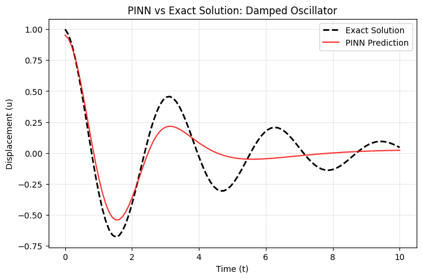

# SciML: Damped Harmonic Oscillator using PINNs

This repository implements a Physics-Informed Neural Network (PINN) to solve the damped harmonic oscillator equation.

## Results

## How it works
The model uses a standard MLP with a custom loss function that incorporates the governing differential equation: $m\ddot{u} + \mu\dot{u} + ku = 0$.
