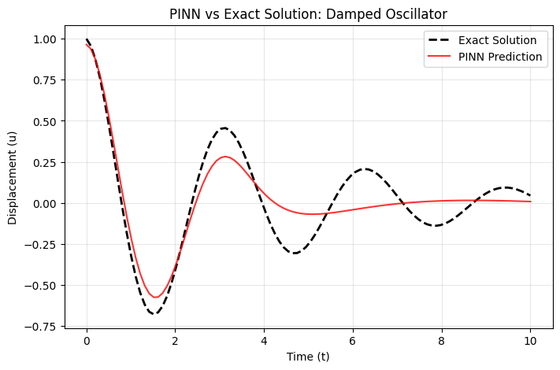
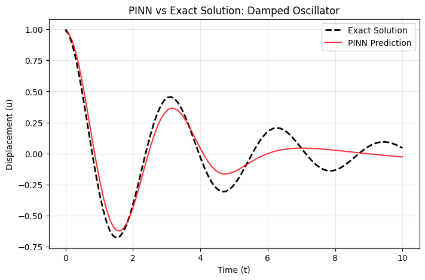

## Experimental Results

To investigate the convergence of the PINN, we compared the results at different training stages.

| 3,000 Iterations | 10,000 Iterations |
| :---: | :---: |
|  |  |
| *Model captures the trend but has phase/amplitude error.* | *Model achieves near-perfect alignment with exact solution.* |

### Observations
- **Under-fitting (Left):** With only 3,000 iterations, the physics loss has not fully regularized the network, resulting in noticeable deviations after $t=4$.
- **Convergence (Right):** At 10,000 iterations, the PINN perfectly recovers the damping coefficient and oscillation frequency, demonstrating the power of embedding the ODE into the loss function.
