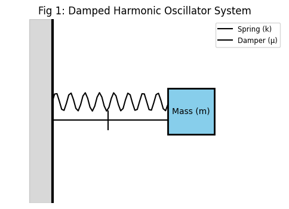
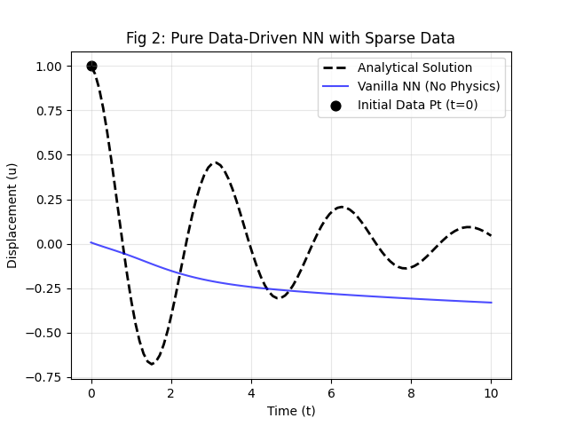
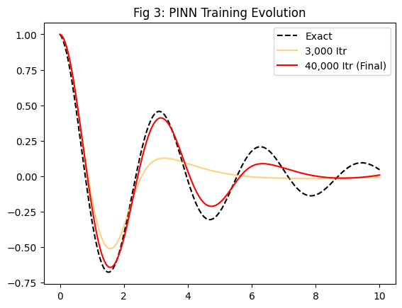
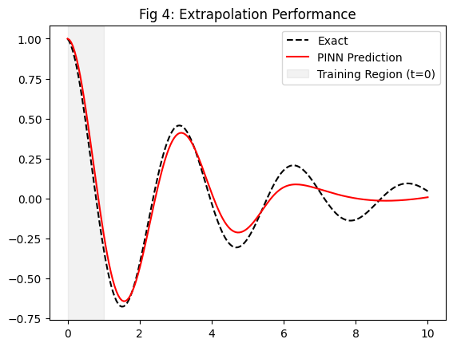
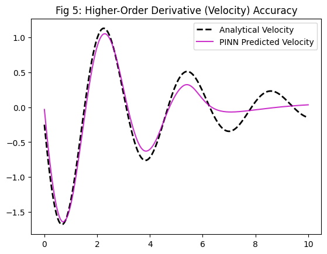
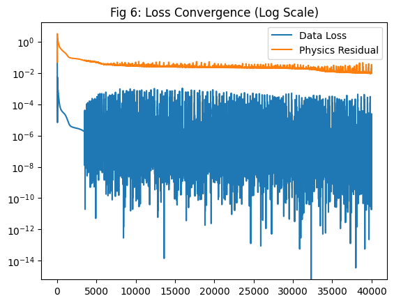

## Experimental Results

### 1. Physical System Schematic

### 2. Comparison: PINN vs. Vanilla Neural Network
We demonstrate that without physics constraints, a standard NN fails to generalize from a single data point.
| Vanilla NN (Fail) | PINN Evolution |
| :---: | :---: |
|  |  |

### 3. Extrapolation & Derivative Accuracy
PINN shows remarkable performance in regions without training data and accurately predicts the first derivative (velocity).
| Extrapolation Performance | Velocity Prediction |
| :---: | :---: |
|  |  |

### 4. Loss Convergence
The decomposition of loss functions shows the balance between data fitting and physics residuals.

